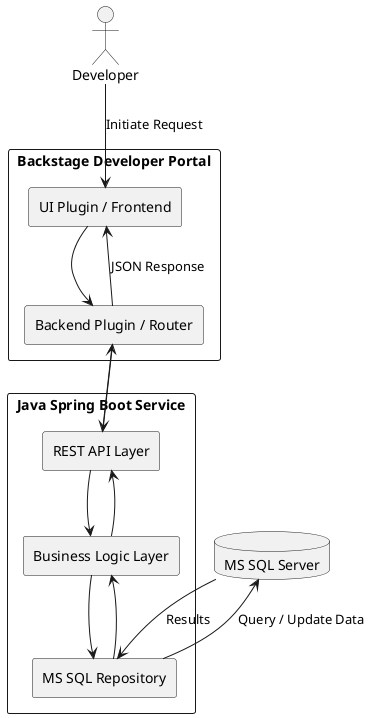

Here’s a **PlantUML visual diagram** that represents the high-level architecture of how **Backstage** connects with your existing **Spring Boot APIs** and **MS SQL Server**:

---

### 📊 **PlantUML Diagram: Backstage Integration with Developer Portal DB**



---

### 💡 How to Render

You can paste this into any PlantUML editor or renderer like:

- [PlantUML Online Server](https://www.plantuml.com/plantuml/)
- IntelliJ plugin for PlantUML
- VSCode PlantUML extension

---

Let me know if you want to include authentication flows (e.g., OAuth, JWT), CI/CD interactions, or extend this diagram for plugin-specific architecture (frontend + backend plugin separation).


Here’s a **high-level document** that outlines how **Backstage** integrates with your **current Developer Portal database**, using your existing **Java Spring Boot API** and **MS SQL Server**:

---

## 📘 High-Level Architecture Document: Backstage Integration with Existing Developer Portal Database

### 1. **Objective**
To describe how the Backstage Internal Developer Portal integrates with the existing Developer Portal database using pre-existing Spring Boot APIs that interact with the MS SQL Server.

---

### 2. **Components Involved**

| Component          | Description |
|-------------------|-------------|
| **Backstage**      | Open-source Internal Developer Portal used for managing software catalog, developer tools, and infrastructure automation. |
| **Spring Boot API** | Existing microservice exposing RESTful endpoints to interact with the Developer Portal database. |
| **MS SQL Server**   | Relational database that stores Developer Portal metadata, such as applications, teams, permissions, configurations, etc. |

---

### 3. **Integration Architecture**

```text
+------------------+          +------------------+          +---------------------+
|     Backstage    | <-----> | Spring Boot APIs | <-----> |   MS SQL Server DB  |
+------------------+          +------------------+          +---------------------+
         ↑                           ↑                                 ↑
         |                           |                                 |
   Backstage Plugin           API Gateway /         Data stored in application tables
     or Backend               Internal Routing         (Apps, Teams, Roles, etc.)
```

---

### 4. **Data Flow**

1. **User Action in Backstage**  
   - User initiates an action via UI plugin (e.g., create app, fetch app list, request access).

2. **Backstage Plugin / Backend Makes API Call**  
   - Plugin or backend code sends HTTP(S) request to the Spring Boot API.

3. **Spring Boot API Handles Logic**  
   - Validates request, applies business logic, interacts with MS SQL Server via JPA/MyBatis.

4. **MS SQL Server**  
   - Executes CRUD operations and returns results via Spring Boot API to Backstage.

5. **Response Displayed in Backstage**  
   - UI updates with real-time status (success, error, data rendered in tables/cards).

---

### 5. **Authentication & Authorization**

| Layer          | Mechanism Used         |
|----------------|------------------------|
| **Backstage**  | Authentication via SSO / OAuth / LDAP |
| **API Layer**  | Token-based (e.g., JWT) or API Key |
| **Database**   | Secure credentials used in Spring Boot config (`application.yml`) |

---

### 6. **Backstage Plugin Responsibilities**

- Define routes and endpoints to interact with backend.
- Handle frontend rendering (React-based).
- Example actions:
  - Fetch list of applications
  - Trigger CI/CD creation
  - Manage team access

---

### 7. **Spring Boot API Responsibilities**

- Maintain existing business logic.
- Secure and validate inputs.
- Communicate with MS SQL Server using ORM or JDBC.
- Return structured JSON responses to Backstage.

---

### 8. **Benefits of Using Existing API Layer**

- **Reusability**: No need to duplicate logic in Backstage.
- **Security**: Centralized access control.
- **Separation of Concerns**: Backstage handles UI; Spring Boot handles business logic and DB.

---

### 9. **Monitoring & Logging**

- **Backstage**: Uses built-in logging and plugin logs.
- **Spring Boot**: Logs with SLF4J / Logback, integrated with ELK / Splunk.
- **Database**: SQL Server logging/auditing for critical tables.

---

### 10. **Future Enhancements (Optional)**

- Add GraphQL support in Spring Boot for flexible queries.
- Create a dedicated Backstage backend plugin (Node.js) to abstract API calls.
- Implement caching for frequently accessed data.

---

Let me know if you want a visual diagram, sample code snippets (Backstage plugin or API calls), or a deployment architecture version of this document.
