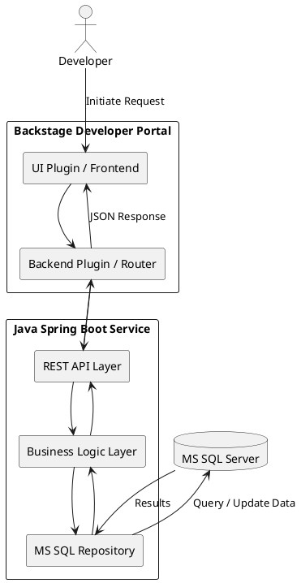

Here’s a **PlantUML visual diagram** that represents the high-level architecture of how **Backstage** connects with your existing **Spring Boot APIs** and **MS SQL Server**:

---

### 📊 **PlantUML Diagram: Backstage Integration with Developer Portal DB**

---

### 💡 How to Render

You can paste this into any PlantUML editor or renderer like:

- [PlantUML Online Server](https://www.plantuml.com/plantuml/)
- IntelliJ plugin for PlantUML
- VSCode PlantUML extension

---

Let me know if you want to include authentication flows (e.g., OAuth, JWT), CI/CD interactions, or extend this diagram for plugin-specific architecture (frontend + backend plugin separation).
